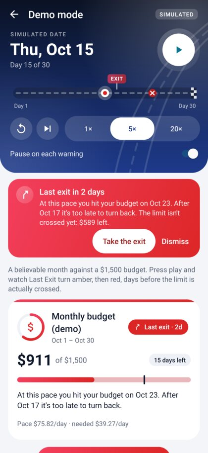
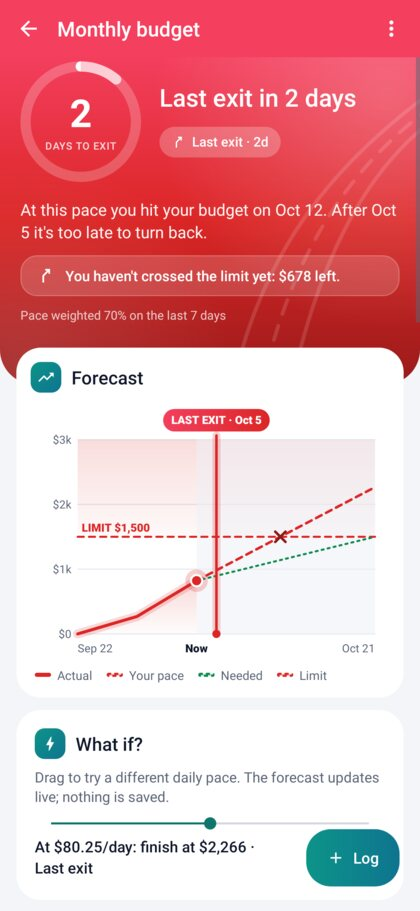
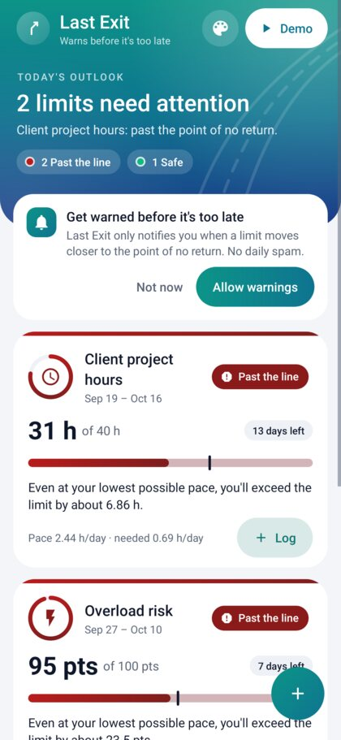
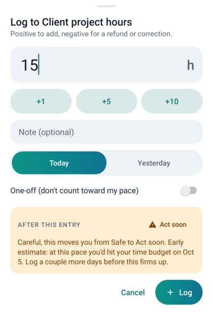
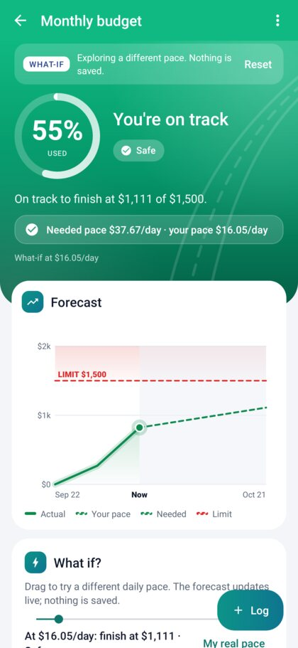
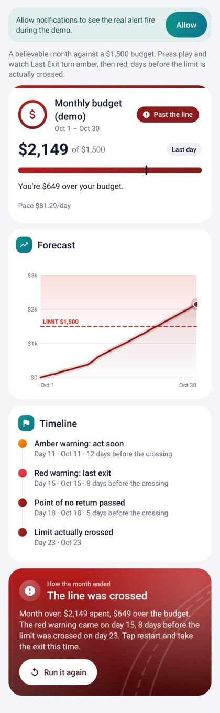
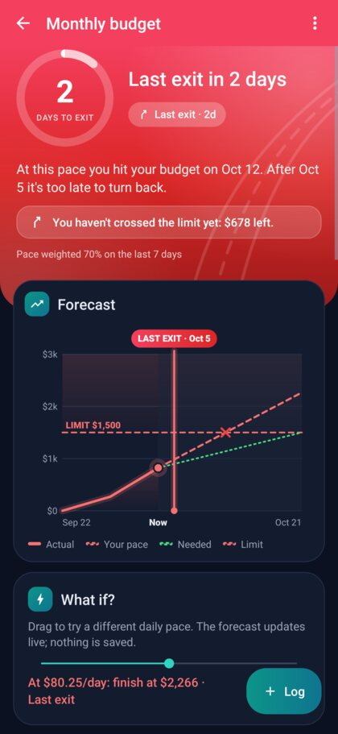
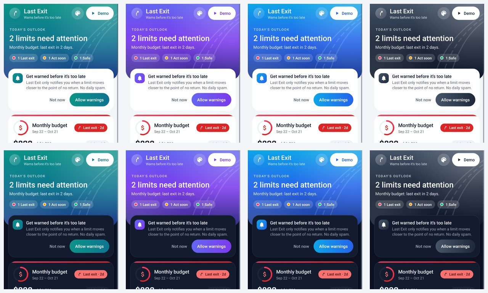

# Last Exit

**Most trackers tell you where you are. Last Exit tells you the last day you can still turn around.**

Last Exit is a native Android app for the CODEXIS hackathon theme: *a tool that helps people keep an eye on something that can be pushed too far, and warns them clearly before they cross the line and it's too late to turn back.* It tracks money, time, resources or risk against a limit. For each one it calculates a **last exit date**: the latest day on which a realistic change in behaviour still keeps you under the limit. It warns you before that date passes, usually days or weeks before the limit itself is crossed.

**[Download the APK (`dist/LastExit-v1.1.apk`, 0.9 MB, Android 8.0+)](dist/LastExit-v1.1.apk)** · [Upgraded build prompt](docs/PROMPT.md)

| Demo: red warning, limit not crossed yet | Detail: chart with the LAST EXIT marker | Home: worst first |
|---|---|---|
|  |  |  |

| Quick-log previews the status before you commit | What if? (nothing saved) | Demo: warned 8 days before the crossing | Dark mode |
|---|---|---|---|
|  |  |  |  |

**Four colour themes (plus Wallpaper on Android 12+), each in light and dark:**



These screenshots are real renders of the app's screens, taken by the automated UI tests (see [Tests](#tests)).

## Install the APK on a phone

1. Copy `dist/LastExit-v1.1.apk` to the phone (or open this repo's file page on the phone and download it).
2. Tap it. Android asks you to allow installs from that source the first time; allow it and tap **Install**.
3. Or, with USB debugging on: `adb install -r dist/LastExit-v1.1.apk`.

If an older build signed with a different key is installed, uninstall it first.

## How it works

For each tracker Last Exit knows the limit **L**, what's been used **U**, the days left after today **R**, and your pace **r**. The pace is a weighted average: 70% from the last 7 days and 30% from the whole period, with one-off entries excluded. You also tell it how hard you could realistically cut back: the lowest pace **m** you could actually hold, as a fraction of your current pace.

```
projected total      P = U + r·R
needed pace          q = (L − U) / R
last exit (days)     x = (L − U − m·R) / (r − m)   // keep pace r for x days, then drop to m: you land exactly on L
limit-hit day        h = ceil((L − U) / r)
```

| Status | When | Example message |
|---|---|---|
| ✅ **Safe** | projected ≤ limit | On track to finish at $1,420 of $1,500. |
| ⚠️ **Act soon** | projected over, last exit more than 3 days away (or more than 15% of the remaining time) | At this pace you hit your budget on Nov 22. You have 4 days to change course. |
| ↗️ **Last exit** | last exit within that window | At this pace you hit your budget on Oct 23. After Oct 17 it's too late to turn back. |
| 🛑 **Past the line** | x < 0: even your lowest realistic pace overshoots | Even at your lowest possible pace, you'll exceed the limit by about $120. |

Each warning comes with three concrete recovery options:
- the cut needed if you act today;
- the (harder) cut needed if you wait until the last exit;
- what changing nothing costs: extra limit needed, or how many days early you run out.

With only one or two days of data, the engine caps warnings at *Act soon* and says it's an early estimate, so one big first entry doesn't shout "too late".

## The 60-second demo script

Open the app and tap **Demo** (top right). Demo data is simulated and never touches your real trackers.

| Time | Do | Say |
|---|---|---|
| 0:00 | Show Home | "Most trackers tell you when you've hit your limit. By then it's too late. Last Exit tells you the last day you can still turn around." |
| 0:08 | In Demo, pick **5×** and press ▶ | "Here's a believable month against a $1,500 budget. Watch the date." |
| 0:15 | It auto-pauses on **day 11: Act soon** (amber, buzz, notification) | "A weekend away pushed the pace up. Twelve days before the money actually runs out, it tells me to act soon." |
| 0:25 | Press ▶ again: **day 15: Last exit in 2 days** (red pulse, stronger buzz, real notification) | "This is the moment that matters: I still have $589 left, but after the 17th no realistic cut-back saves the month. That's the last exit, marked on the chart." |
| 0:38 | Tap **Take the exit**, press ▶ | "If I take it, spending drops to $35 a day…" |
| 0:48 | Month ends: **Back on track, $1,436 of $1,500** | "…and I finish under budget. The warning came in time." |
| 0:53 | (Optional) **Run it again** at 20× with "Pause on each warning" off | "Ignore it, and the limit is crossed on day 23. Last Exit warned me eight days earlier." |

## What makes it different from a normal budget tracker

1. **It warns about the last recoverable moment, not the limit.** A budget bar turns red when you're out of money. Last Exit turns red while there's still $589 left, because that's the last point where a realistic change still works.
2. **It's honest about what you can actually do.** "How hard can you cut back?" sets the lowest pace you could hold. One-off entries don't distort the pace, and early estimates never cry wolf. Every warning comes with exact numbers: cut $X/day today, or $Y/day if you wait.
3. **It works for any limit, and it previews consequences.** The same engine covers money, study hours, client hours, mobile data and overload risk. The quick-log sheet shows *"this moves you from Safe to Act soon"* before you save, and the What-if slider lets you explore any pace without saving anything.

## Design and themes

Calm until urgent, with colour that means something:
- **Gradient headers that carry the state.** Home's header uses the theme gradient, with today's outlook and a count of limits per status. On Detail the whole header turns the status gradient (emerald, amber, red, crimson) and cross-fades when the status changes, with a ring gauge counting the days to the last exit.
- **Cards with a status strip.** A gradient strip across the top, a ring gauge of the limit used around the type icon, gradient progress bars that show the projection, and soft tinted shadows.
- **A "night drive" demo cockpit.** The simulated month is drawn as a road with your position, an **EXIT** sign at the last exit and a ✕ where the money runs out.
- **Themes without losing meaning.** The palette button on Home opens *Make it yours*: Highway, Midnight, Ocean, Graphite or Wallpaper (Material You), and System, Light or Dark, with a live preview. Status colours are the same in every theme, so red always means red.
- **The launcher icon** is a gradient adaptive icon with a themed monochrome layer for Android 13+.

## Features

- **Home:** cards sorted worst first. Each has a status chip (icon + text + colour), a big used amount, days left, a progress bar with a translucent projection and a limit tick, a plain-language message and a **Log** button. There's also an attention summary, the notification-permission prompt, and a friendly empty state.
- **Detail:** a status-tinted hero, then a Canvas chart showing actual usage, the projection, the needed pace, the limit, the limit-hit ✕ and a **LAST EXIT** marker. Below it: key numbers, recovery steps, the cut-back slider, and history with swipe-to-delete plus Undo.
- **Quick-log sheet:** amount (signed, decimal), +1/+5/+10 chips (commitment sizes for Risk), note, today or yesterday, a one-off switch, and a live status preview.
- **What if?:** a slider that changes the daily pace and live-updates the hero, chart, numbers and status. A haptic tick fires at each stage boundary; nothing is saved.
- **Templates:** Monthly Budget, Student Study Hours (burnout cap), Freelance Project Hours, Mobile Data Plan, Overload Risk. Every form field is validated with inline errors.
- **Notifications:** one high-importance channel and a permission rationale on Android 13+, falling back to *Open settings* when needed. A periodic background check (every 3 hours, survives reboots) notifies only when a tracker moves to a **worse** stage, using `lastNotifiedStatus`. Tapping a notification deep-links to that tracker (`lastexit://tracker/{id}`). In the foreground you get an in-app banner plus haptics instead.
- **Demo mode:** a simulated date with play/pause, 1×/5×/20×, +1 day and restart, and auto-pause on each warning. The status escalates green → amber → red → past the line before the limit is crossed. Each step fires a banner, an escalating vibration, chip pop/shake/pulse, a colour transition and a real notification. It also offers **Take the exit**, a milestone timeline with lead times, and an outcome card.
- **Themes:** four colour themes plus Wallpaper (Android 12+) and System/Light/Dark, saved across launches. Framework widgets (switches, date pickers) follow the chosen accent.
- **Polish:** gradient headers and buttons, dark mode, TalkBack sentences on every card, heading semantics, live regions, 48 dp targets, and "Remove animations" respected. Rotation and process death keep the back stack, open sheets, half-filled forms, the what-if pace and demo progress.

## Run it from source (Android Studio)

1. Install a recent Android Studio (Ladybug 2024.2 or newer) and open this folder. Let Gradle sync: it downloads Gradle 8.9 and Android Gradle Plugin 8.7.3. Accept any prompt to install SDK Platform 34.
2. **Emulator:** Device Manager → create a Pixel with an API 34 image → select it → press **Run ▶** (configuration `app`).
3. **Physical device:**
   1. On the phone, open Settings → About phone and tap *Build number* 7 times to unlock Developer options.
   2. Turn on **USB debugging** under Developer options.
   3. Plug the phone in and accept the prompt, then pick the phone in the device menu and press **Run ▶**.
4. Command line: `./gradlew assembleDebug` (APK in `app/build/outputs/apk/debug/`), `./gradlew test` for all tests, or `./gradlew :core:test` for the engine only.

## Project structure

```
core/                       Pure Kotlin module, no Android imports (enforced by the build)
  ForecastEngine.kt         Pace, projection, last exit, stages, early-estimate cap, recovery
  ForecastSeries.kt         Chart data in "day space"
  ForecastMessages.kt       Every user-facing sentence, unit tested next to the math
  Formatting.kt             "$1,240", "12.5 h", "Oct 14"
  Templates.kt              The five templates (dates computed from today)
  DemoScenario.kt           The demo month and the Take-the-exit plan
  src/test/                 58 JUnit tests
app/
  data/                     SQLite (FK cascade), in-memory TrackerStore, models
  notify/                   Notifier (channel, deep links), StatusMonitor, LimitCheckJobService
  ui/                       MainActivity (back stack, deep links, permission), Screen base
  ui/home|detail|edit|log|demo/   Screens and the quick-log sheet
  ui/kit/                   Themes and palette, gradient drawables, chart, ring gauge, road progress,
                            status chip, progress bar, cards, swipe row, banner, theme sheet, haptics
  src/test/                 Robolectric UI flows on API 26, 31 and 34 (with screenshots)
dist/LastExit-v1.1.apk      Ready-to-install build
docs/PROMPT.md              The upgraded hackathon prompt
tools/offline-apk/          Reproducible APK build without Google Maven (see below)
```

## Architecture notes

- **The engine is the product.** `ForecastEngine` is a pure function of `ForecastInput`, which includes `today`, so Demo mode can fast-forward time and every edge case is unit tested. The Android code only renders what the engine says.
- **Zero third-party runtime dependencies.** The app uses only the Android framework and the Kotlin standard library: custom Canvas views, `SQLiteOpenHelper`, `JobScheduler` and a small route stack in one Activity. That's why the APK is 0.9 MB and starts instantly.
- **Why not Compose, Room and WorkManager, as in the original prompt?** The machine that built this had no access to Google's Maven repository, where all AndroidX libraries live, so it was built on the framework instead. Each requested component maps one to one:

  | Original prompt | Here |
  |---|---|
  | Compose UI | Custom framework Views and Canvas |
  | Room | SQLite with a cascading foreign key |
  | WorkManager | JobScheduler (periodic, persisted) |
  | Navigation Compose | A route back stack with deep links |
  | ViewModel / StateFlow | Screens observing a single in-memory store, with state saved in Bundles |

  [`docs/PROMPT.md`](docs/PROMPT.md) keeps the Compose stack, with exact versions, for teams with normal internet access.
- **Threading:** every mutation happens on the main thread against an in-memory snapshot. SQLite writes then go, in order, to one background thread. Storage failures are logged rather than crashing.

## Tests

- **`./gradlew :core:test`:** 58 JUnit tests covering:
  - zero entries, R ≤ 0, r = 0, r ≤ m, negative amounts, limit already exceeded;
  - exact stage boundaries (x = 4 → amber, 3 → red, 0 → red today, −1/30 → past);
  - the weighted pace, one-offs, red window scaling, recovery numbers, the early-estimate cap;
  - message copy, formatting, templates, and the demo arc (amber → red → past before the crossing; taking the exit on any warning day ends green and under the limit).
- **`./gradlew :app:testDebugUnitTest`:** 15 end-to-end flows on the real screens with Robolectric native graphics, each run on Android 8.0, 12 and 14 (45 runs):
  - the full demo with real notifications, Take the exit, and the crossing;
  - rotation, template → quick-log, detail and What-if, worst-first ordering, dark mode;
  - deep links, the background check not repeating, form validation, edit/delete/undo, and every drawable inflating;
  - the theme picker (Midnight + Dark applied and remembered), and every theme rendered in light and dark.

  Each flow saves PNG screenshots to `app/build/shots/`.

## How `dist/LastExit-v1.1.apk` was built

The sandbox that built this project could reach Maven Central and Ubuntu's package archive, but not Google's servers. So the APK was produced by [`tools/offline-apk/build.sh`](tools/offline-apk/build.sh):
- `aapt2`, `dx`, `zipalign` and `apksigner` come from Ubuntu packages;
- the Android 14 framework comes from Robolectric's `android-all` jar on Maven Central;
- Kotlin is compiled with Gradle using Java 8 APIs only.

The APK is signed with APK Signature Scheme v2 and v3, `resources.arsc` is stored uncompressed and aligned, and the same sources pass both test suites above. In Android Studio the normal Gradle build (AGP + D8 + R8) is used instead.

## Assumptions

- Dates are whole days: today's entries count toward today, and R counts the days after today up to the deadline.
- Moving the deadline later only adds days of usage, so the third recovery option reports the extra limit needed and how many days early you'd run out.
- `minPaceFactor` is set with "How hard can you cut back?", 10–100% in 5% steps (factor = 1 − cut).
- targetSdk 34 as specified, so predictive back and edge-to-edge enforcement don't apply yet.
